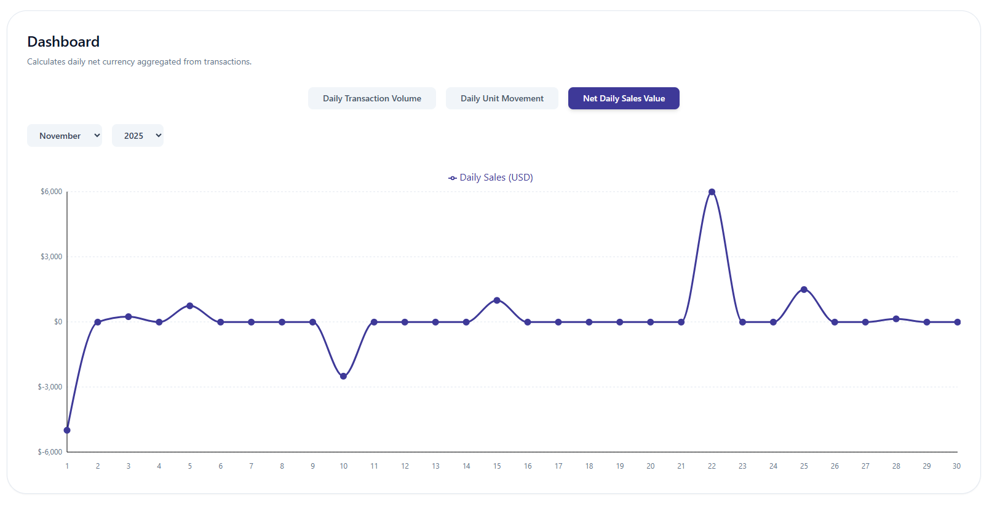
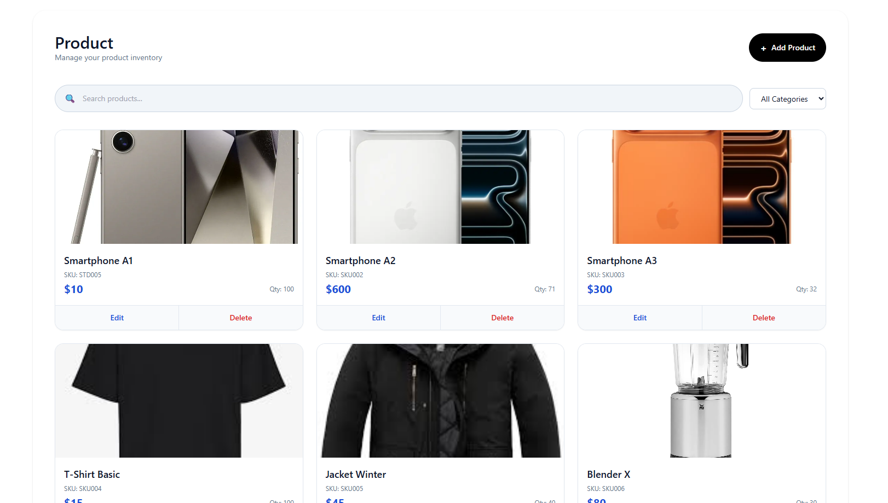
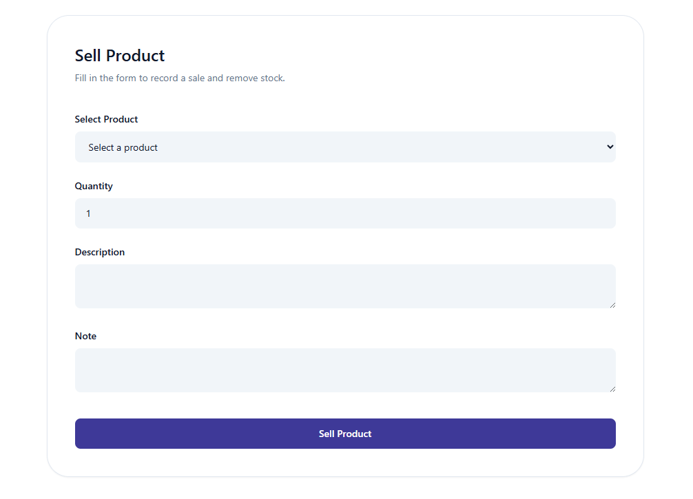
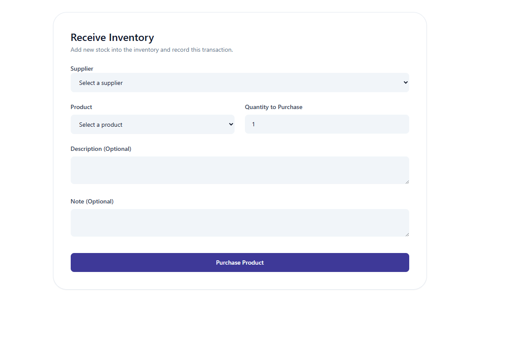
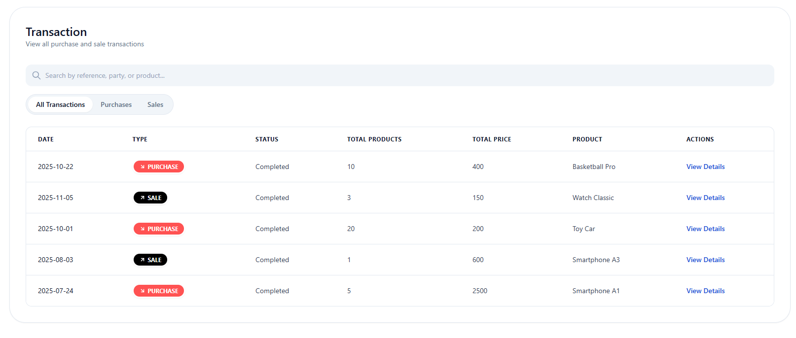
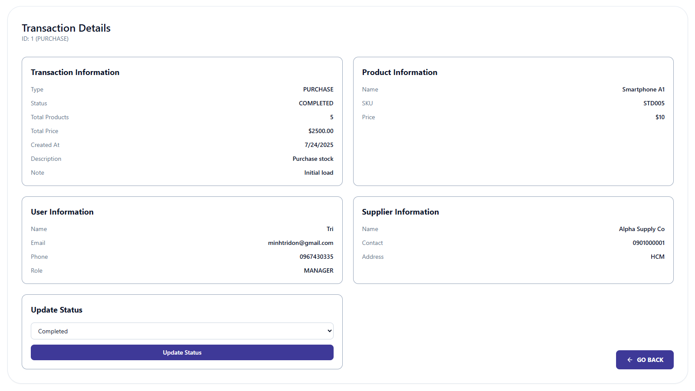
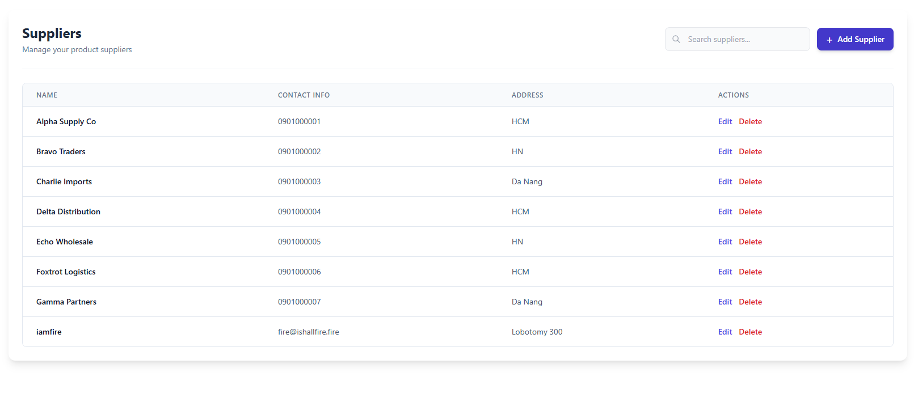
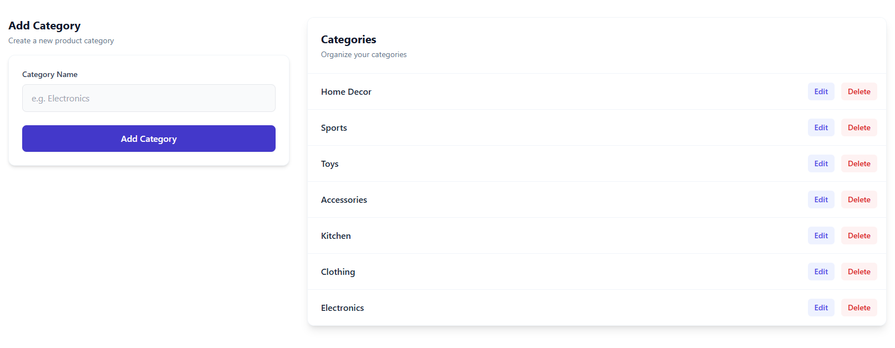
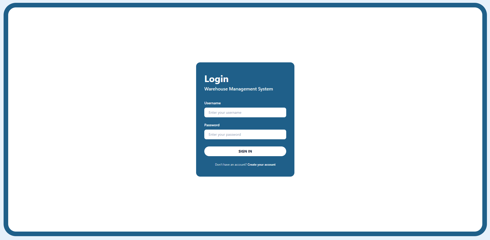
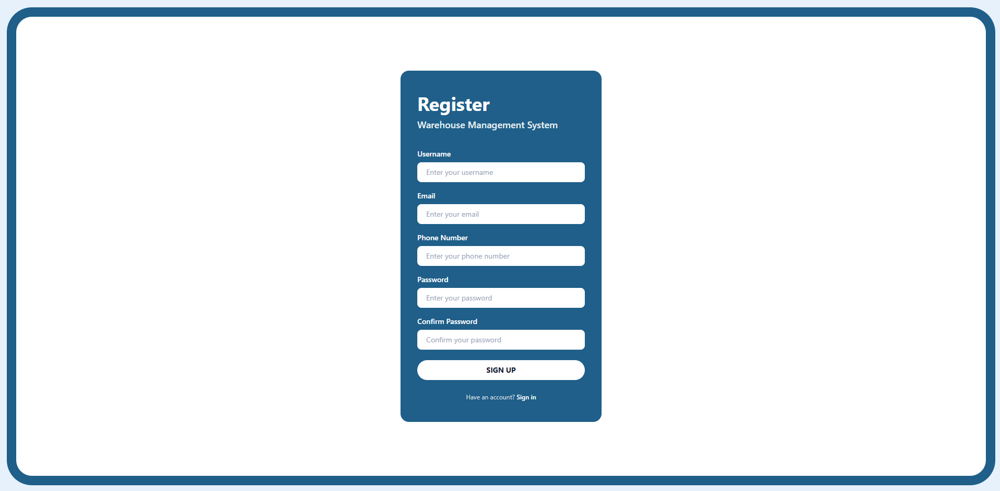

# Warehouse Management System (WMS) - Group 02's Project Submission for PDM_Sem01_2025-2026 HCMIU

A comprehensive full-stack warehouse management system designed to help businesses efficiently manage inventory, track suppliers, and monitor transactions. This application provides a complete solution for managing Purchases, Sales, and Returns operations with real-time analytics and intuitive user interface.

## Introduction

The Warehouse Management System (WMS) is a full-stack application developed for Principles of Database Management course. It streamlines warehouse operations by providing tools for inventory management, supplier tracking, and transaction processing. The system aims to be a simple-to-use financial ledge for businesses to maintain accurate inventory records, manage supplier relationships, and gain insights through visual analytics on transaction patterns.

Key capabilities include tracking product inventory with image support, recording purchase and sale transactions, managing supplier information and product categories, and providing detailed analytics through an interactive dashboard.

## Group Members

This project is developed by Group 02, consisted of the following awesome members:
- Lê Thái Minh Tín (ITCSIU24086)
- Huỳnh Minh Toàn (ITCSIU24088) 
- Huỳnh Sơn Anh Tuấn (ITCSIU24093)
- Trịnh Minh Trí (ITITIU24069)
- Bùi Thị Thanh Ngân (ITCSIU24061)
- Phạm Như Nguyên Trung (ITCSIU24091)
- Nguyễn Hoàng Yến Nhi (ITCSIU24064)
- Nguyễn Minh Đức (ITCSIU24021)
- Nguyễn Ngọc Phương Như (ITCSIU24065)
- Lê Vân Ly (SESEIU24017)

## Tech Stack

### Backend
- **Java 21** - Programming language
- **Spring Boot 3.3.5** - Application framework
- **Spring Security** - Authentication and authorization
- **Spring Data JPA** - Database persistence layer
- **Spring Boot Validation** - Input validation
- **Lombok** - Reducing boilerplate code
- **JWT (JSON Web Tokens)** - Secure authentication using `jjwt` library (v0.12.6)
- **MySQL** - Relational database management system
- **AWS SDK S3** - Image file storage (v2.29.6)
- **ModelMapper** - Object mapping utility (v3.2.1)
- **Maven** - Dependency management and build tool

### Frontend
- **React 19.2.0** - UI library
- **Vite** - Build tool and development server
- **Tailwind CSS** - Utility-first CSS framework for styling
- **Recharts 3.4.1** - Charting library for data visualization
- **React Query (@tanstack/react-query 5.90.8)** - Server state management
- **React Hook Form 7.66.0** - Form handling
- **Zod 4.1.12** - Schema validation
- **Axios 1.13.2** - HTTP client
- **React Router DOM 7.9.5** - Client-side routing

### Database
- **MySQL** - Primary database for storing all application data

## Key Features

### 📊 Dashboard
Interactive analytics dashboard with visual charts powered by Recharts. Features include:
- **Daily Transaction Volume**: Tracks the count of purchase and sale records created each day
- **Daily Unit Movement**: Monitors total number of items moved (in and out) per day
- **Net Daily Sales Value**: Calculates daily net currency aggregated from transactions
- Interactive line charts with month/year filtering
- Real-time data visualization with responsive design



### 📦 Product Management
Complete CRUD operations for inventory management:
- Create, read, update, and delete products
- Image upload support with AWS S3 integration
- Product categorization system
- Inventory quantity tracking
- Search and pagination capabilities




### 💼 Transaction Tracking
Comprehensive transaction management:
- **Purchases**: Record incoming inventory from suppliers
- **Sales**: Track outgoing product sales
- Transaction history with detailed views
- Transaction status tracking
- Automatic inventory updates on transactions






### 👥 Supplier & Category Management
Full CRUD capabilities for:
- **Suppliers**: Manage supplier information, contact details, and relationships
- **Categories**: Organize products into logical groupings
- Validation and data integrity checks



### 🔐 Authentication
Secure user authentication system:
- JWT-based authentication (JSON Web Tokens)
- Secure login and registration
- Protected routes for authenticated users
- Role-based access control
- Password encryption




## Getting Started

### Prerequisites

Ensure you have the following installed on your system:

- **Java 21** or higher
- **Node.js** (v18 or higher recommended) and **npm**
- **MySQL** (v8.0 or higher)
- **Maven** (optional, Maven Wrapper included)

### Database Setup

1. Start your MySQL server.

2. Create the database:
```sql
CREATE DATABASE inventory_db;
```

3. The application will automatically create tables using Hibernate's `ddl-auto=update` mode on first run. No manual SQL scripts are required.

### Backend Setup

1. Navigate to the Backend directory:
```bash
cd Backend
```

2. Configure database connection in `src/main/resources/application.properties` (see Configuration section below).

3. Run the Spring Boot application:

**Using Maven Wrapper (Windows):**
```bash
.\mvnw.cmd spring-boot:run
```

**Using Maven Wrapper (Linux/Mac):**
```bash
./mvnw spring-boot:run
```

**Using Maven (if installed):**
```bash
mvn spring-boot:run
```

The backend server will start on `http://localhost:5050`.

### Frontend Setup

1. Navigate to the frontend directory:
```bash
cd frontend
```

2. Install dependencies:
```bash
npm install
```

3. Start the development server:
```bash
npm start
```

The frontend application will be available at `http://localhost:3000` (or the next available port).

## Configuration

### Backend Configuration

Configure the following properties in `Backend/src/main/resources/application.properties`:

```properties
# Application Name
spring.application.name=Backend

# Server Port
server.port=5050

# Database Configuration
spring.sql.init.platform=mysql
spring.datasource.url=jdbc:mysql://localhost:3306/inventory_db
spring.datasource.username=YOUR_DATABASE_USERNAME
spring.datasource.password=YOUR_DATABASE_PASSWORD
spring.datasource.driver-class-name=com.mysql.cj.jdbc.Driver

# JPA/Hibernate Configuration
spring.jpa.hibernate.ddl-auto=update

# JWT Secret Key (use a strong, random string in production)
secreteJwtString=YOUR_JWT_SECRET_KEY_HERE

# File Upload Configuration
spring.servlet.multipart.max-file-size=2GB
spring.servlet.multipart.max-request-size=2GB
```

**Important Security Notes:**
- Replace `YOUR_DATABASE_USERNAME` and `YOUR_DATABASE_PASSWORD` with your actual MySQL credentials
- Generate a strong, random string for `secreteJwtString` (minimum 64 characters recommended)
- Never commit actual passwords or secrets to version control

### AWS S3 Configuration (for Image Uploads)

If you plan to use AWS S3 for image storage, ensure you have:
- AWS credentials configured (via environment variables or AWS credentials file)
- Appropriate S3 bucket permissions
- AWS SDK S3 dependency is already included in `pom.xml`

## Project Structure

```
warehouse-management-PDM-Fall25/
├── Backend/                          # Spring Boot Backend
│   ├── src/
│   │   ├── main/
│   │   │   ├── java/
│   │   │   │   └── org/pdm/backend/
│   │   │   │       ├── controller/   # REST API Controllers
│   │   │   │       ├── model/        # Entity Models
│   │   │   │       ├── repository/   # Data Access Layer
│   │   │   │       ├── service/      # Business Logic Layer
│   │   │   │       ├── security/     # Security & JWT Configuration
│   │   │   │       ├── exception/    # Exception Handling
│   │   │   │       └── wrappers/     # DTOs and Request/Response Wrappers
│   │   │   └── resources/
│   │   │       └── application.properties
│   │   └── test/                     # Unit Tests
│   ├── pom.xml                       # Maven Dependencies
│   └── mvnw, mvnw.cmd                # Maven Wrapper
│
├── frontend/                         # React Frontend
│   ├── src/
│   │   ├── components/               # Reusable Components
│   │   ├── features/                 # Feature-based Modules
│   │   │   ├── categories/
│   │   │   ├── products/
│   │   │   ├── suppliers/
│   │   │   ├── transactions/
│   │   │   └── users/
│   │   ├── pages/                    # Page Components
│   │   ├── lib/                      # Utility Libraries
│   │   └── App.js                    # Root Component
│   ├── public/                       # Static Assets
│   ├── package.json                  # NPM Dependencies
│   └── tailwind.config.js            # Tailwind Configuration
│
└── docs/                             # Project Documentation
```

## API Endpoints

The backend provides RESTful API endpoints for:
- **Authentication**: `/api/auth/login`, `/api/auth/register`
- **Products**: `/api/products` (CRUD operations)
- **Categories**: `/api/categories` (CRUD operations)
- **Suppliers**: `/api/suppliers` (CRUD operations)
- **Transactions**: `/api/transactions` (Create and retrieve)
- **Users**: `/api/users` (Profile management)

All protected endpoints require JWT authentication token in the `Authorization` header.

## Development

### Running Tests

**Backend:**
```bash
cd Backend
./mvnw test
```

**Frontend:**
```bash
cd frontend
npm test
```

### Building for Production

**Backend:**
```bash
cd Backend
./mvnw clean package
```

**Frontend:**
```bash
cd frontend
npm run build
```

## License

This project was developed for educational purposes as part of Principles of Database Management course, from HCMIU.

## Contributing

This is an academic project. For questions or contributions, please contact the project maintainer (@Dorecepha).

---

**Note**: This system was developed to demonstrate full-stack development practices using modern Java Spring Boot and React technologies.

